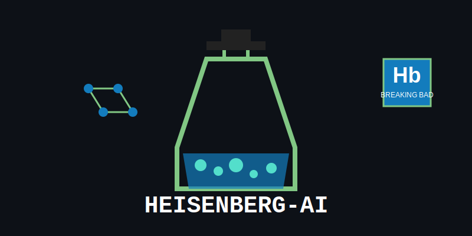

# Heisenberg-AI

[](LICENSE)

A Streamlit-based chatbot application that simulates conversations with Walter White (Heisenberg) from Breaking Bad, focusing on chemistry-related topics while maintaining his distinctive personality.

## Features

- Interactive chat interface with Walter White's character
- Stylized message bubbles for an immersive chat experience
- Responses generated using Microsoft's MAI-DS-R1 AI model via OpenRouter
- Chemistry-focused conversations with Walter White's persona
- HTML-formatted responses for rich text display

## Demo



## Installation

### Prerequisites

- Python 3.7+
- pip (Python package installer)

### Setup

1. Clone the repository:
   ```bash
   git clone https://github.com/Yahya/Heisenberg-AI.git
   cd Heisenberg-AI
   ```

2. Create and activate a virtual environment:
   ```bash
   python -m venv venv
   
   # On Windows
   venv\Scripts\activate
   
   # On macOS/Linux
   source venv/bin/activate
   ```

3. Install required dependencies:
   ```bash
   pip install -r requirements.txt
   ```

4. Create a `.env` file in the project root directory with your OpenRouter API key:
   ```
   OPEN_ROUTER_API_KEY=your_openrouter_api_key
   ```

## Usage

1. Start the Streamlit application:
   ```bash
   streamlit run app/WalterWhite.py
   ```

2. Open your web browser and navigate to `http://localhost:8501`

3. Start chatting with Walter White by typing chemistry-related questions or inquiries about his character

## Project Structure

```
Heisenberg-AI/
├── app/
│   ├── __init__.py
│   ├── WalterWhite.py   # Main Streamlit application
│   └── ai.py            # OpenRouter API integration
├── assets/
│   └── heisenberg-ai-logo.svg
├── .env                 # Environment variables (not included in repo)
├── .gitignore
├── LICENSE
├── README.md
└── requirements.txt
```

## Configuration

The AI's behavior is defined through the system prompt in `app/ai.py`. Walter White's character is configured to:

- Respond to chemistry-related questions
- Provide information about his own character when asked
- Reply with "I don't know" to topics outside his knowledge domain
- Format responses in HTML for enhanced readability

## API Integration

This application uses the OpenRouter API with Microsoft's MAI-DS-R1 model. To use the application:

1. Create an account at [OpenRouter](https://openrouter.ai/)
2. Generate an API key
3. Add the key to your `.env` file as shown in the setup instructions

## Contributing

Contributions are welcome! Please feel free to submit a Pull Request.

1. Fork the repository
2. Create your feature branch (`git checkout -b feature/amazing-feature`)
3. Commit your changes (`git commit -m 'Add some amazing feature'`)
4. Push to the branch (`git push origin feature/amazing-feature`)
5. Open a Pull Request

## License

This project is licensed under the MIT License - see the [LICENSE](LICENSE) file for details.

## Disclaimer

This application is created for entertainment and educational purposes only. It simulates a fictional character and should not be used to generate harmful content or promote illegal activities.

## Acknowledgments

- Breaking Bad for the character inspiration
- OpenRouter for providing API access to advanced language models
- Streamlit for an interactive web application framework
